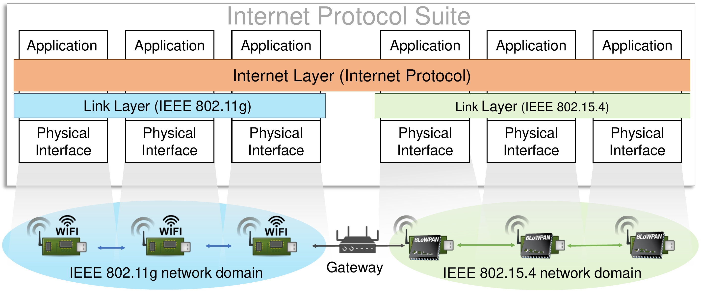
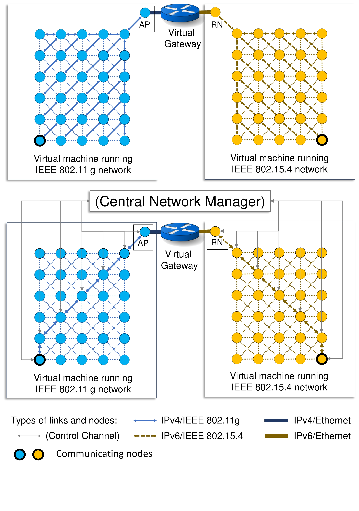

## Table of contents
* [Project](#Project)
* [Tools](#Tools)
* [Description](#Description)

## Project
```
Title:          Rapid Prototype of Network Manager in Simulated Heterogeneous
                IoT Networks (hetiot-nm)

One-liner:      Demonstration and conceptualization of network management in IoT 
                hetnets through Linux based IP tools and virtualization with 
                simulated networks.
            
Publication:    Selvaraju, S.P., Balador, A., Fotouhi, H., Vahabi, M. and 
                Bjorkman, M., 2021, June. Network Management in Heterogeneous 
                IoT Networks. In 2021 International Wireless Communications and 
                Mobile Computing (IWCMC) (pp. 1581-1586). IEEE.

Developer:      Selvaraju, Shunmuga Priyan
e-mail:         shunmuga.selvaraju@mdh.se (shanmu.thukaram@gmail.com)
```	
## Technologies
Project is created with:
* Mininet-wifi
* linux-wpan/rpld
* Jool-NAT64
* VirtualBox
* Ubuntu-20.04
	
## Description
```
/
|- conf/            holds conffiguration files used in setting up 6LoWPAN 
|                   network simulation
|- log/             holds results from previous runs
|- mininet-wifi/    git submodule
|- rpld/            git submodule
|- scripts/
       mn-wifi-vm/  holds scripts to run inside the VM for running mininet-WiFi
       rpld-vm/     holds scripts to run inside the VM for running linux-wpan/
                    rpld
```
### Important files
adhoc* - script files to be runned for demonstrating centrally managed networks
         using IP tool in Linux systems.
mesh*  - script files to be runned for demonstrating distributively managed 
         networks using routing protocols such as IEEE 802.11s and RPL.

### Scenario
Demonstration of use-case scenario of IP network layer to control and manage the
routing, node-addressing and connection establishment in both wireless networks.
The experiment was primarily developed to showcase the versatility of a centrally
managed network in controlling and configuring IoT hetnets against the limitatio-
ns of distributed networking where individual nodes perform the routing functions.

The following use case has been implemented:


With the following configuration:
